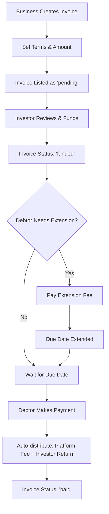

# 📄 Automated Invoice Financing Platform

> **Smart Contract-Powered Invoice Factoring System**  
> Transform your business cash flow with decentralized invoice financing on Stacks blockchain ⚡

[](https://github.com/hirosystems/clarinet)
[](https://stacks.co/)
[](https://clarity-lang.org/)

## 🎯 Overview

The Automated Invoice Financing Platform revolutionizes traditional invoice factoring by providing a **trustless, transparent, and efficient** marketplace where:

- 🏢 **Businesses** can immediately access working capital by selling their outstanding invoices
- 💰 **Investors** earn attractive returns by funding invoices with built-in risk assessments
- 🔒 **Smart contracts** eliminate intermediaries and reduce counterparty risk
- 📊 **Reputation systems** reward reliable businesses with better rates

## ✨ Key Features

### 🚀 Core Functionality
- **Invoice Creation**: Businesses submit invoices with debtor details and payment terms
- **Automated Funding**: Investors can instantly fund invoices with calculated discounts
- **Risk-Based Pricing**: Dynamic interest rates based on business reputation and invoice size
- **Payment Processing**: Streamlined settlement with automatic fee distribution
- **Default Management**: Built-in mechanisms to handle non-performing invoices

### 🆕 **Due Date Extension** (New Feature)
- **One-Time Extensions**: Debtors can extend payment deadlines once per invoice
- **Investor Compensation**: Extension fees are paid directly to investors
- **Flexible Terms**: Up to 720 blocks (≈5 days) additional time
- **Audit Trail**: Complete transparency of extension requests and payments

### 📈 Advanced Features
- **Business Profiles**: Track payment history, reputation scores, and default rates
- **Investor Analytics**: Monitor portfolio performance and earnings
- **Platform Statistics**: Real-time insights into total volume and activity
- **Fee Management**: Automated platform fee collection and withdrawal

## 🏗️ Smart Contract Architecture

### Data Structures

```clarity
;; Core invoice data
invoices: {
  business: principal,
  debtor: principal, 
  amount: uint,
  funded-amount: uint,
  interest-rate: uint,
  due-at: uint,
  status: string
}

;; Extension tracking (NEW)
invoice-extensions: {
  extra-duration: uint,
  fee: uint,
  extended-at: uint,
  extended-by: principal
}
```

### Key Parameters

| Parameter | Value | Description |
|-----------|-------|-------------|
| **Min Invoice** | 1,000 STX | Minimum invoice amount |
| **Max Invoice** | 10,000,000 STX | Maximum invoice amount |
| **Min Duration** | 144 blocks | Minimum payment term (≈1 day) |
| **Max Duration** | 4,320 blocks | Maximum payment term (≈30 days) |
| **Base Interest** | 5% | Starting interest rate |
| **Platform Fee** | 2.5% | Fee on successful payments |
| **Extension Fee** | 0.75% | Fee for due date extensions |
| **Max Extension** | 720 blocks | Maximum extension period (≈5 days) |

## 🚀 Getting Started

### Prerequisites
- [Clarinet](https://github.com/hirosystems/clarinet) v3.4.0+
- [Node.js](https://nodejs.org/) v16+
- Stacks Wallet for testnet interactions

### Installation

1. **Clone the repository**
   ```bash
   git clone https://github.com/your-org/Automated-Invoice-Financing.git
   cd Automated-Invoice-Financing
   ```

2. **Verify the contract**
   ```bash
   clarinet check
   ```

3. **Start local development**
   ```bash
   clarinet console
   ```

### Basic Usage Examples

#### Creating an Invoice
```clarity
(contract-call? .Automated-Invoice-Financing create-invoice 
  'ST1DEBTOR-ADDRESS 
  u50000    ;; 50,000 STX invoice
  u1440)    ;; 10-day payment term
```

#### Funding an Invoice
```clarity
(contract-call? .Automated-Invoice-Financing fund-invoice u1)
```

#### Extending Payment Due Date ⚡ NEW
```clarity
(contract-call? .Automated-Invoice-Financing extend-due-date 
  u1      ;; invoice ID
  u288)   ;; extend by 2 days (288 blocks)
```

#### Paying an Invoice
```clarity
(contract-call? .Automated-Invoice-Financing pay-invoice u1)
```

## 🔄 Workflow



## 💡 Risk Management

### For Investors
- **Reputation Scoring**: Businesses earn better rates through consistent payments
- **Default Penalties**: Higher interest rates for businesses with payment history issues
- **Time Limits**: Automatic default marking after grace periods
- **Extension Compensation**: Additional fees when debtors request more time

### For Businesses  
- **Transparent Pricing**: Clear interest rate calculations based on risk factors
- **Flexible Extensions**: One-time payment deadline extensions available
- **Reputation Building**: Good payment history leads to lower financing costs

## 📊 Economic Model

### Interest Rate Calculation
```
Base Rate (5%) + 
Reputation Adjustment (0-2%) + 
Amount Adjustment (0-1%) + 
Default Penalty (3% per previous default)
```

### Fee Structure
- **Platform Fee**: 2.5% of total payment (paid by debtor)
- **Extension Fee**: 0.75% of invoice amount (paid to investor)
- **No upfront fees** for businesses or investors

## 🧪 Testing

```bash
# Run contract syntax check
clarinet check

# Interactive testing console
clarinet console

# Run integration tests (when available)
npm test
```

## 📋 API Reference

### Public Functions

| Function | Parameters | Description |
|----------|------------|-------------|
| `create-invoice` | debtor, amount, duration | Submit new invoice for funding |
| `fund-invoice` | invoice-id | Provide capital for specific invoice |
| `pay-invoice` | invoice-id | Settle invoice payment |
| `extend-due-date` | invoice-id, extra-duration | **NEW**: Extend payment deadline |
| `mark-default` | invoice-id | Admin function for defaults |
| `withdraw-platform-fees` | - | Admin function for fee collection |

### Read-Only Functions

| Function | Returns | Description |
|----------|---------|-------------|
| `get-invoice` | Invoice details | Retrieve invoice information |
| `get-business-profile` | Business stats | Get business reputation data |
| `get-investor-profile` | Investment stats | Get investor portfolio data |
| `get-platform-stats` | Platform metrics | Overall system statistics |
| `get-invoice-extension` | Extension details | **NEW**: Extension history |

## 🔐 Security Considerations

- ✅ **Owner-only functions** protected with access controls
- ✅ **Input validation** for all parameters and amounts
- ✅ **State checks** prevent invalid state transitions
- ✅ **Balance verification** before fund transfers
- ✅ **One-time actions** enforced (extensions, payments)
- ✅ **Overflow protection** in mathematical operations

## 🗺️ Roadmap

- [ ] **Multi-token support** (USDC, other stablecoins)
- [ ] **Batch operations** for multiple invoice management  
- [ ] **Insurance pools** for additional investor protection
- [ ] **Credit scoring integration** with external data providers
- [ ] **Mobile app** for easier access and notifications
- [ ] **Cross-chain compatibility** with other blockchain networks

## 🤝 Contributing

We welcome contributions! Please see our [Contributing Guidelines](CONTRIBUTING.md) for details.

1. Fork the repository
2. Create your feature branch (`git checkout -b feature/amazing-feature`)
3. Run tests and ensure code quality
4. Commit your changes (`git commit -m 'Add some amazing feature'`)
5. Push to the branch (`git push origin feature/amazing-feature`)
6. Open a Pull Request

## 📄 License

This project is licensed under the MIT License - see the [LICENSE](LICENSE) file for details.

## 🙏 Acknowledgments

- Built on [Stacks Blockchain](https://stacks.co/) for Bitcoin-secured smart contracts
- Powered by [Clarity](https://clarity-lang.org/) for predictable and secure contract logic
- Developed with [Clarinet](https://github.com/hirosystems/clarinet) for robust testing

---

**Ready to transform your business cash flow? Start using Automated Invoice Financing today!** 🚀

*For support, questions, or partnership inquiries, reach out to our team.*
